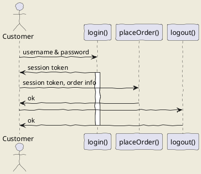

# Programación Orientada a Objetos: POO :japanese_ogre: :snake: :octocat: :milky_way: :ghost: :computer: :gun: :meat_on_bone: :rocket: :100:

## ___¿Por qué aprender Programación Orientada a Objetos?___

1. Programaré más rápido: Mejoro mi capacidad de análisis, pienso bien lo que voy a hacer antes de entrar al código.

2. Dominaré conceptos como Encapsulamiento, abstracción, herencia y polimorfismo.

3. Dejo de copiar y pegar código: Ya puedo tomar control sobre mi aplicación, no terminará siendo un Frankenstein, un producto que no sabe donde empieza ni donde termina.

### **Finalmente tendré la capacidad de:**

* Análizar: Observar, entender y leer muy bien el problema. Empezaré a pensar de forma distinta.
* Plasmar: Diseñaré y crearé los diagramas, después de haber realizado el respectivo análisis.
* Programar: Programaré diagramas con cualquier lenguaje que soporte POO.

## ___¿Qué resuelve la Programación Orientada a Objetos?___

La programación Orientada a Objetos nace de los problemas creados por la programación estructurada y nos ayuda a resolver cierto problemas como:

* Código muy largo: A medida que un sistema va creciendo y se hace más robusta el código generado se vuelve muy extenso haciéndose difícil de leer, depurar, mantener.

* Si algo falla, todo se rompe: Ya que con la programación estructurada el código se ejecuta secuencialmente al momento de que una de esas líneas fallara todo lo demás deja de funcionar.

* Difícil de mantener.

## ___Paradigma Orientado a Objetos:___

La Programación Orientada a Objetos viene de una filosofía o forma de pensar que es la Orientación a Objetos y esto surge a partir de los problemas que necesitamos plasmar en código.

Es analizar un problema en forma de objetos para después llevarlo a código, eso es la Orientación a Objetos.

**Un paradigma es una teoría que suministra la base y modelo para resolver problemas.**

El paradigma de Programación Orientada a Objetos se compone de:

* 4 elementos

    * Clases
    * Propiedades
    * Métodos
    * Objetos

* Y 4 Pilares

    * Encapsulamiento
    * Abstracción
    * Herencia
    * Polimorfismo

### **Algunos de los lenguajes de programación Orientados a Objetos son:**

* Java:
– Orientado a Objetos naturalmente
– Es muy útilizado en Android
– Y es usado del lado del servidor o Server Side

* PHP
– Lenguaje interpretado
– Pensado para la Web

* Python
– Diseñado para ser fácil de usar
– Múltiples usos: Web, Server Side, Análisis de Datos, Machine Learning, etc

* Javascript
– Lenguaje interpretado
– Orientado a Objetos pero basado en prototipos
– Pensado para la Web

* C#
* Ruby
* Kotlin

## ___Diagramas de Modelado:___

* OMT: Object Modeling Techniques. Es una metodología para el análisis orientado a objetos.

* UML: Unified Modeling Language o Lenguaje de Modelado Unificado. Tomó las bases y técnicas de OMT unificándolas. Tenemos más opciones de diagramas como lo son Clases, Casos de Uso, Objetos, Actividades, Iteración, Estados, Implementación.

## ___UML-Unified Modeling Language:___

UML es un lenguaje estándar de modelado de sistemas orientados a objetos. Esto significa que tendremos una manera gráfica de representar una situación, los elementos que puedes utilizar para hacer estas representaciones.

### Las ***clases*** se representan así:

En la parte superior se colocan los atributos o propiedades, y debajo las operaciones de la clase. Notarás que el primer caracter con el que empiezan es un símbolo. Este denotará la visibilidad del atributo o método, esto es un término que tiene que ver con Encapsulamiento.

### Estos son los ***niveles de visibilidad*** que puedes tener:

* \- private
* \+ public
* \# protected
* \~ default

Una forma de representar las relaciones que tendrá un elemento con otro es a través de las flechas en UML, y aquí tenemos varios tipos, estos son los más comunes:

## Asociación

Como su nombre lo dice, notarás que cada vez que esté referenciada este tipo de flecha significará que ese elemento contiene al otro en su definición. La flecha apuntará hacia la dependencia.

Con esto vemos que la *ClaseA* está asociada y depende de la ***ClaseB.***

## Herencia

Siempre que veamos este tipo de flecha se estará expresando la herencia.
La dirección de la flecha irá desde el hijo hasta el padre.

Con esto vemos que la *ClaseB* hereda de la ***ClaseA***

## Agregación

Este se parece a la asociación en que un elemento dependerá del otro, pero en este caso será: Un elemento dependerá de muchos otros. Aquí tomamos como referencia la multiplicidad del elemento. Lo que comúnmente conocerías en Bases de Datos como Relaciones uno a muchos.

Con esto decimos que la *ClaseA* contiene varios elementos de la ***ClaseB.*** Estos últimos son comúnmente representados con listas o colecciones de datos.

## Composición

Este es similar al anterior solo que su relación es totalmente compenetrada de tal modo que conceptualmente una de estas clases no podría vivir si no existiera la otra.

*[Tutorial - Diagrama de Clases UML](https://www.youtube.com/watch?v=Z0yLerU0g-Q)*

## ___Objetos:___

Los objetos son elementos de nuestra realidad con los que interactuamos(pueden ser físicos o conceptuales).

Los patrones o aspectos comunes que hallamos al ***observar objetos*** similares nos forman un concepto de lo que ese objeto representa para nosotros, como lo percibimos o representamos. La obtención las ideas principales o esencia común de los objetos analizados se llama abstracción; El concepto idealizado, generalizado de dichos objetos viene a ser representado por la “Clase”.

La clase es un modelo del objeto, algo así como un sello o molde y los objetos serían como la estampa o elemento elaborado por el molde; Los objetos son ejemplares de una clase. Entendemos a estas “clases” como dos conjuntos de: atributos o propiedades y comportamientos. (Las clases son sustantivos)

Los atributos (también son sustantivos, generalmente descriptivos) son características o propiedades, rasgos, adjetivos que definen al modelo. Por ejemplo, los atributos de una clase serian:

* id
* nombre
* raza
* color

y los de un objeto serían:

* 101
* Rocky
* Dálmata
* Blanco
* moteado
* negro

Los comportamientos también definen la clase o al objeto mediante acciones que puede realizar (por tanto, son verbos o sustantivo_verbo)

El contexto es clave para realizar una abstracción útil que realmente ayude a resolver el problema planteado.

## ___Modularidad:___

La modularidad va muy relacionada con las clases y es un principio de la Programación Orientado a Objetos y va de la mano con el Diseño Modular que significa dividir un sistema en partes pequeñas y estas serán nuestros módulos pudiendo funcionar de manera independiente.

La modularidad de nuestro código nos va a permitir:

* Reutilizar
* Evitar colapsos
* Hacer nuestro código más mantenible
* Legibilidad
* Resolución rápida de problemas
* Una buena práctica es separando las clases en archivos diferentes.

## ___Sintaxis de Clases en diferentes lenguajes:___

## ___¿Qué es la herencia?___

***«DRY: Don’t repeat yourself»*** es una filosofía que promueve la reducción de duplicación en programación, esto nos va a inculcar que no tengamos líneas de código duplicadas. Toda pieza de información nunca debería ser duplicada debido a que incrementa la dificultad en los cambios y evolución.

***«Cuando detecto características y comportamientos iguales, entonces significa que debo realizar una abstracción»*** con herencia. La herencia nos permite crear nuevas clases a partir de otras, se basa en modelos y conceptos de la vida real. También tenemos una jerarquía de padre e hijo.

